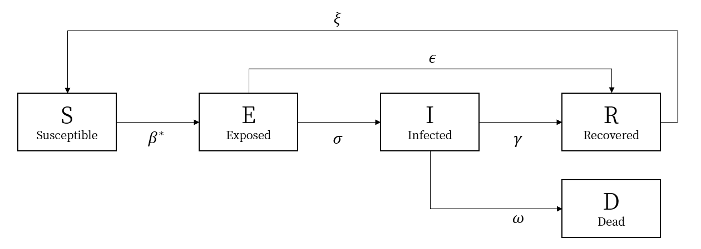

# Infection Network Simulation


## What is this project?
At one time, COVID-19 spread widely. During that period, I modeled the spread of infectious diseases using graph theory for a high school project. I researched various mathematical models of infectious diseases and appropriately modified them to utilize graph theory. Additionally, this project supports visualization, allowing simulation results to be exported as images or video files. Original presentation materials is at `resource/Infection Network.pptx`

## How to run a code?
This project has been verified to work with Python 3.10 and uses the `pipenv` virtual environment. If `pipenv` is not installed, please run the following command first:

```shell
pip install pipenv
```

If `pipenv` is installed, run the following command in the project root directory to install the required libraries for this project. To check what libraries this project uses, please see `Pipfile.lock`.

```shell
pipenv sync
```

To run the simulation, use the `run_simulation()` function located in `src/infection.py`. You can check a simulation example through `src/demo.py`. The following command executes `src/demo.py`.

```shell
pipenv run python src/demo.py
```

If you want to change the simulation parameters, provide different parameters of the `run_simulation()` function. Instructions for setting the parameters are explained at the bottom of `README.md`. You can export the simulation results as images, videos, or in real time. Option settings are also explained at the bottom of the document.

## Background knowledge to understand the project
Before starting, please note that this project aimed for a proof of concept rather than academic achievement, so it has not undergone scholarly peer review. Therefore, some of the background explanations might be slightly incorrect, and there may be errors in the research methodology. Most of the background knowledge was referenced from the [SEIR/SEIRS explained article by the Institute for Disease Modeling(IDM)](https://docs.idmod.org/projects/emod-hiv/en/latest/model-seir.html).

The most famous and traditional modeling methods for infectious disease modeling are the SEIR and SEIRS models. This model is a quite simple differential equation model. Referring to the diagram below will be helpful.


The SEIR model divides the entire population into four groups: `Susceptible`, `Exposed`, `Infectious`, and `Recovered`. Susceptible individuals are neither infected nor immune; in other words, they are people who have not yet encountered the disease. Exposed individuals have contracted the disease but are still in the incubation period and cannot transmit the disease to others. Infectious individuals have started showing symptoms and can transmit the disease to others. Lastly, Recovered individuals have overcome the disease and developed immunity. These individuals will not contract the disease again even if exposed to the virus.

The number of people in these four groups changes each day. Susceptible individuals contract the disease from Infectious individuals. Therefore, the higher the proportion of Infectious individuals in the total population, the more patients will emerge. Exposed individuals transition to Infectious after a certain incubation period. Infectious individuals eventually recover and become Recovered.

These assumptions can be represented by ordinary differential equations. The equations are as follows. Note that $N$ represents the total population, where $N = S + E + I + R$.

$$
\begin{cases}
    & \frac{dS}{dt} = -\beta S \frac{I}{N} + [\xi R] \\
    & \frac{dE}{dt} = \beta S \frac{I}{N} - \sigma E \\
    & \frac{dI}{dt} = \sigma E - \gamma I \\
    & \frac{dR}{dt} = \gamma I - [\xi R]\\
\end{cases}
$$

The main difference between the SEIR and SEIRS models lies in whether immunity diminishes over time. The SEIR model assumes that once immunity is acquired, it lasts for life. For instance, someone who contracts measles usually does not get measles again. Therefore, the SEIR model is used when modeling diseases like measles. On the other hand, the SEIRS model is used when immunity wanes over time. For example, just because someone had a cold once doesn't mean they are immune for life. This distinction is illustrated in the diagram above with dashed lines. The SEIR model lacks dashed lines, whereas the SEIRS model includes them. Similarly, terms enclosed in the square bracket in the ordinary differential equations above apply only to the SEIRS model.

## SEIRD Model

In this project, I slightly modified the SEIRS model to create the SEIRD model. The reasons for modifying the existing model are as follows:

* The primary reason for modification was the utilization of graph theory in this project rather than differential equations. Therefore, to integrate Markov Chains into this theory, significant modifications were necessary to the model.
* The SEIR/SEIRS models are typically used for modeling non-lethal diseases. Since I wanted to model a different scenario, I chose to create a new model rather than simply adding coefficients to represent fatalities.
* During the COVID-19 pandemic, there were reports of some infected individuals recovering without showing any symptoms. While this occurrence was rare, I wanted to explore and include such cases in my modeling.

The SEIRD model is as follows:



Izn the SEIRD model, the most notable changes are that a fraction of the Infected individuals will die with probability $\omega$, thereby being removed from the total population. Additionally, some of the Exposed individuals become "silent carriers," recovering without exhibiting any symptoms, with a probability $\epsilon$.

The SEIRD model uses graph theory while SEIR/SEIRS model uses differential equations. In this simulation, each person is represented as a vertex, and individuals who could potentially infect each other are connected by edges. And everyone, verticies, is in one of the states: S (Susceptible), E (Exposed), I (Infected), R (Recovered), or D (Dead), and every day, their next state is probabilistically determined according to a Markov chain. For instance, a person currently in the Exposed state will, in the next time unit, transition to Infected with probability $\sigma$, to Recovered with probability $\epsilon$, or remain in the Exposed state with probability $1-\sigma-\epsilon$.

Unlike SEIR/SEIRS, $\beta^\ast$ is not a single value but is determined differently for each node. All Susceptible nodes will transition to the Exposed state with a probability $\beta$ whenever there is at least one currently Infected node connected to them through an edge. This models the idea that people are infected because they have friends who are infected, and the more infected friends they have, the more likely they are to become infected themselves.

However, not all infections are from friends, i.e., through edges. Therefore, a very small coefficient $\tau$ is added. This allows individuals to have a certain probability of contracting the disease proportional to the overall ratio of current infections, regardless of edges. Note that assuming $\beta >> \tau$ is highly recommended.

Mathematically, for a graph $G = (V, E)$, the infectious rate $\beta^\ast(G, v)$ for a node $v$ can be expressed as follows:

$$
\beta^\ast(G, v) = (1 - \prod_{\substack{w \in \textrm{adj}_G(v) \cap I}}{(1 - \beta)}) + \tau \frac{|I|}{|N|}
$$

(TODO : Example simulation graph attachment)

## Simulation Setup
To run a simulation, call `run_simulation()`. It has three parameters: `env_params`, `scenario_params`, and `export_options`. Each parameter is a dictionary that contains the necessary information for the simulation. The following sections explain how to set each parameter.

### Step 1. Environment Parameters
An error will occur if any of them are not configured. Each variable can be set as follows:

| Parameter Name | Explain |
|----------|----------|
| `total_populations` | The total number of populations in the simulation. |
| `simulate_days` | The number of days the simulation will run. |
| `average_friends` | The average number of friends each person has. |
| `patient_zeros` | The number of `Infected` individuals at day 0 in the simulation. |

Note that it is NOT true that all the people has exactly `average_friends` number of friends. Instead, the current program is implemented as the following: The simulation initially decides whether each two person is friend or not randomly with a probability of *freind density*. *Friend density* is calculated as `average_friends / total_populations`. Therefore, the number of friends each person has is not exactly `average_friends`, but its probabilistic expectation is equivalent to `average_friends`.

### Step 2. Scenario Parameters
An error will occur if any of them are not configured. Each variable can be set as follows:

| Parameter Name | Explain |
|----------|----------|
| `S2E` | Is equal to $\beta$, **NOT** $\beta^\ast$ |
| `S2E_TAU` | Is equal to $\tau$ |
| `E2I` | Is equal to $\sigma$ |
| `I2R` | Is equal to $\gamma$ |
| `R2S` | Is equal to $\xi$ |
| `I2D` | Is equal to $\omega$ |
| `E2R` | Is equal to $\epsilon$ |

The name of each parameter is easily distinguishable since its name is an abbriviation of the transition it represents. For example, `S2E` means the transition from `Susceptible` to `Exposed`.

### Step 3. Export Options
The simulation can be visualized in three ways: image, video, and real time graph. The following parameters are used to set the visualization options. These are optional while the default value is `False`. At least one of the parameters must be set to `True`, or error will occur.

| Parameter Name | Explain |
|----------|----------|
| `save_image` | If `True`, the simulation result will be saved as an image. |
| `save_video` | If `True`, the simulation result will be saved as a video. |
| `real_time` | If `True`, the simulation result will be visualized in real time. Ignored when `save_video` is `True`. |

Note that if you want to get the results faster, it is recommended to set only `save_image` to `true` only since `save_video` and `real_time` need to render every frames of the simulation. Since of lag, `real_time` option is ignored when `save_video` is `true`.

If you want to export the simulation results as a video, download `ffmpeg.exe` then move it to the `project_root/dependency/ffmpeg.exe` path. You can download the ffmpeg [here](https://ffmpeg.org/download.html). Video export is only supported on Windows. Results images will be generated in the `output/image` path while videos in the `output/video` directory.