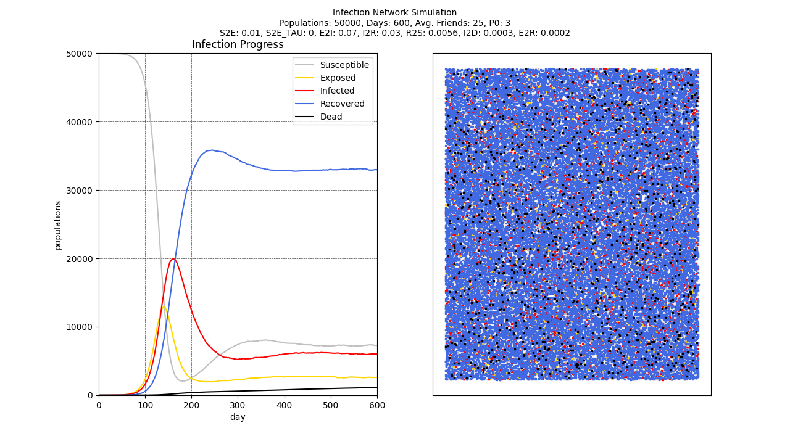

# Infection Network Simulation



## What is this project?
한때 코로나-19가 크게 유행했었지요. 그때 고등학교 프로젝트로 그래프 이론을 활용하여 감염병의 확산을 모델링해 보았습니다. 감염병의 수학적 모델링을 여럿 조사했고, 이를 그래프 이론을 활용할 수 있게 적절히 변형하였습니다. 또한 이 프로젝트는 시각화를 지원하기 때문에 이미지나 동영상 파일로도 시뮬레이션 결과를 내보낼 수 있습니다.

## How to run a code
이 프로젝트는 `Python 3.10`에서 작동함을 확인했고, `pipenv` 가상환경을 사용합니다. `pipenv`가 설치되지 않았다면 먼저 다음의 명령을 실행해 주세요.

```shell
pip install pipenv
```

`pipenv`를 설치했다면 이 프로젝트가 요구하는 라이브러리를 설치하기 위해 다음 명령을 프로젝트 루트에서 실행해 주세요. 이 과정에서 설치되는 라이브러리가 궁금하다면 `Pipfile.lock`을 참조하세요.

```shell
pipenv sync
```

코드 실행을 위해서는 `src/infection.py`를 실행합니다. 다음과 같이 방금 구성한 가상환경에서 코드를 실행하기 위해 다음 명령을 입력하세요.

```shell
pipenv run python src/infection.py
```

시뮬레이션 파라미터를 변경하고 싶다면 `src/infection.py`를 수정해 주세요. 해당 파일에서는 시뮬레이션 결과를 이미지, 영상 또는 실시간으로 확인하는 옵션을 설정할 수 있습니다. 시뮬레이션 결과를 영상으로 내보내고 싶다면 `dependency` 경로를 생성하고 `ffmpeg.exe`를 다운로드해 `dependency/ffmpeg.exe` 경로에 옮겨 주세요. 해당 파일은 [여기](https://ffmpeg.org/download.html)에서 다운로드할 수 있습니다. 영상 내보내기는 Windows에서만 지원합니다. 시뮬레이션 결과를 저장할 경우 이미지는 `output/image`에, 영상은 `output/video` 디렉터리에 생성됩니다. 

## 프로젝트를 이해하기 위한 배경지식
시작하기 전에, 이 프로젝트는 학문적 성과보다는 단순한 proof of concept을 목표했기에 동료평가 같은 학술적인 검토를 받지는 않았습니다! 따라서 설명하는 배경지식이 조금 틀렸을 수도 있고, 연구 방법론에 오류가 있을 수도 있습니다. 대부분의 배경지식은 [SEIR/SEIRS explained article by Institute for Disease Modeling(IDM)](https://docs.idmod.org/projects/emod-hiv/en/latest/model-seir.html)에서 참고했음을 밝힙니다.

감염병 모델링에 있어서 가장 유명하고 전통적인 모델링 방법론은 SEIR Model과 SEIRS 모델링이 있습니다. 이 모델은 간단한 미분방정식 모델인데, 아래의 도식을 참조하면 도움이 될 것입니다.


SEIR 모델은 모든 인구를 Susceptible, Exposed, Infectious, Recovered와 같은 4개의 그룹으로 나눕니다. Susceptible은 질병에 걸리지는 않았지만 질병에 면역도 없는, 평범한 사람들입니다. Exposed는 질병에 걸렸지만 아직 증상이 나타나지 않아서 다른 사람들에게 병을 옮길 수도 없는, 즉 잠복기 중에 있는 사람들입니다. Infectious는 질병에 걸려 증상이 나타나기 시작했고, 따라서 다른 사람들에게 병을 옮기는 감염자들입니다. 마지막으로 Recovered는 병이 나아서 면역력을 가지고 있는 사람들을 나타납니다. 이 그룹의 사람들은 다시 바이러스에 노출되더라도 이미 항체가 생성되었기에 질병에 걸리지 않습니다.

위의 4개 그룹의 사람들은 매 단위 시간이 지날 때마다 인구수에 변동이 발생합니다. Susceptible은 Infectious에게 병이 옮습니다. 따라서 전체 인구 중 Infectious가 차지하는 비율이 많을수록 더 많은 환자가 생기겠지요. 따라서 Susceptible은 전체 인구수 중 Infectious의 비율만큼 새롭게 병에 걸려 Exposed로 변합니다. 또한 Exposed는 일정 시간이 지나면 잠복기가 끝나고 Infectious로 바뀌게 됩니다. 또한 Infectious는 일정 시간이 지나면 병이 나아서 Recovered로 바뀌게 됩니다.

이러한 가정들은 상미분방정식으로 나타낼 수 있습니다. 이때 식은 다음과 같습니다. 이때 $N$은 전체 인구수로, $N = S + E + I + R$임을 참고하십시오.

$$
\begin{cases}
    & \frac{dS}{dt} = -\beta S \frac{I}{N} + \{\xi R\} \\
    & \frac{dE}{dt} = \beta S \frac{I}{N} - \sigma E \\
    & \frac{dI}{dt} = \sigma E - \gamma I \\
    & \frac{dR}{dt} = \gamma I - \{\xi R\}\\
\end{cases}
$$

SEIR 모델과 SEIRS 모델의 가장 큰 차이는 시간이 지남에 따라 면역이 사라지는지의 여부입니다. SEIR 모델은 한 번 생긴 면역은 평생 사라지지 않을 때 사용합니다. 예를 들어, 한 번 홍역에 걸린 사람은 거의 대부분 다시는 홍역에 걸리지 않습니다. 따라서 홍역을 모델링할 때는 SEIR 모델을 사용합니다. SEIRS 모델은 시간이 지나면 면역이 사라질 때 사용합니다. 예를 들어, 어떤 사람이 감기에 걸렸다고 해서 평생 감기에 면역인 것은 아닙니다. 이러한 차이는 위의 도식에서 점선으로 나타납니다. SEIR 모델은 점선이 없고, SEIRS 모델은 있습니다. 마찬가지로, 위의 수식에서 중괄호로 둘러싸인 항은 SEIRS에만 적용되는 항입니다.

## SI3D 모델

저는 이 프로젝트에서 위의 SEIRS 모델을 살짝 수정하여 SI3D 모델을 만들었습니다. 기존의 모델을 수정한 이유는 다음과 같습니다.

*  SEIR/SEIRS 모델은 치명적이지 않은 질병을 모델링할 때 사용되기 때문에 기존의 모델을 사용하지 않고 새로운 모델을 만들었습니다. 사망자를 나타내는 계수를 추가하는 방식으로도 접근할 수 있지만, 저는 시각화를 위해 항을 추가하고 싶었습니다.
* Exposed

Markov chain. blah blah